# 实时渲染器

一个基于现代 C++20 和 OpenGL 的实时渲染器演示项目。

## 依赖库

本项目使用以下第三方库：

- **OpenGL** - 图形渲染 API
- **GLFW** - 窗口管理和输入处理
- **GLAD** - OpenGL 函数加载器
- **GLM** - 数学库（向量、矩阵运算）
- **Assimp** - 3D 模型加载
- **ImGui** - 即时模式图形用户界面
- **STB** - 图像加载库
- **TinyEXR** - EXR/HDR 图像格式加载库
- **spdlog** - 高性能日志库

所有依赖库通过 CMake 的 FetchContent 自动下载和构建，无需手动安装。

## 系统要求

- **编译器**: 支持 C++20 的编译器
  - Visual Studio 2022 (Windows)（已测试）
  - MinGW GCC 15+ + Ninja (Windows)（已测试）
- **CMake**: 3.16 或更高版本
- **OpenGL**: 4.3 或更高版本
- **操作系统**: Windows 10+

## 下载和运行

### 1. 克隆仓库

```bash
git clone https://github.com/ma399/A-Real-time-Renderer-and-a-simple-editor.git
cd A-Real-time-Renderer-and-a-simple-editor
```

### 2. 创建构建目录

```bash
mkdir build
cd build
```

### 3. 配置项目

```bash
# Windows (Visual Studio)
cmake .. -G "Visual Studio 17 2022" -A x64

# Windows (MinGW + Ninja)
cmake .. -G "Ninja" -DCMAKE_BUILD_TYPE=Release
```

### 4. 编译项目

```bash
# Windows (Visual Studio)
cmake --build . --config Release

# Windows (MinGW + Ninja)
ninja
```

### 5. 运行程序

```bash
# Windows (Visual Studio)
.\bin\Release\Application.exe

# Windows (MinGW + Ninja)
.\bin\Application.exe
```

## 项目结构

```
├── application/          # 主应用程序
├── Renderer/            # 渲染器核心
│   ├── common/         # 通用组件
│   └── rendering/      # 渲染相关
├── assets/             # 资源文件
│   ├── fonts/         # 字体文件 (Inter字体系列)
│   ├── materials/     # 材质文件
│   ├── models/        # 3D 模型 (OBJ格式)
│   ├── shaders/       # 着色器 (GLSL)
│   └── textures/      # 纹理贴图和天空盒
├── cmake/              # CMake 模块
└── CMakeLists.txt      # 主构建文件
```

## 特色功能

### 先进的渲染管线

- **延迟着色**: 使用 G-Buffer 的多通道渲染，实现高效光照计算
- **PBR (基于物理的渲染)**: 使用金属-粗糙度工作流和 IBL (基于图像的光照) 的真实感材质渲染
- **SSGI (屏幕空间全局光照)**: 使用计算着色器的实时全局光照
- **PCSS 阴影映射**: 百分比接近软阴影，实现真实的软阴影效果
- **天空盒渲染**: 支持立方体贴图的 HDR 环境映射

### 高性能架构

- **基于协程的线程系统**: 使用现代 C++20 协程进行异步任务执行
- **工作窃取线程池**: 多工作线程间的高效负载均衡
- **优先级任务调度**: 支持关键、高、普通和后台任务优先级
- **资源管理系统**: 协程感知的资源加载和缓存机制

### 交互式编辑器

- **ImGui 集成**: 实时参数调节和场景操作
- **性能监控**: 实时统计信息和性能分析
- **场景管理**: 动态对象变换和光照控制

### 现代 C++ 特性

- **C++20 协程**: 使用 async/await 模式实现流畅的资源加载
- **RAII 资源管理**: 自动清理和内存安全保障
- **模板元编程**: 类型安全的着色器 uniform 绑定

### 高级图形技术

- **多目标渲染**: 包含位置、反照率、法线和运动矢量的 G-Buffer
- **计算着色器集成**: GPU 加速的 SSGI 计算
- **帧缓冲管理**: 灵活的渲染目标切换和合成

## 系统架构

```mermaid
classDiagram
    %% Application Layer
    class Application {
        -Window window_
        -Renderer renderer_
        -GUI ui_
        -Camera camera_
        -InputManager input_manager_
        -Scene scene_
        -CoroutineResourceManager resource_manager_
        +initialize() bool
        +run() void
        +shutdown() void
        +request_model_load(path) void
        +add_light_to_scene() bool
        +render_scene() void
    }

    %% Core Rendering System
    class Renderer {
        -int width_, height_
        -GLuint framebuffer_, color_texture_
        -GLuint g_buffer_fbo_
        -GLuint g_position_texture_
        -GLuint g_albedo_metallic_texture_
        -GLuint g_normal_roughness_texture_
        -GLuint ssgi_fbo_, ssgi_raw_texture_
        -bool use_deferred_rendering_
        -bool use_ssgi_
        +initialize() void
        +render(Scene, Camera, ResourceManager) void
        +pbr_render() void
        +set_render_to_framebuffer(bool) void
        +resize_framebuffer(width, height) void
    }

    %% Scene Management
    class Scene {
        -vector renderable_references_
        -vector light_references_
        -vec3 ambient_light_
        +add_renderable_reference(id) void
        +remove_renderable_reference(id) void
        +add_light_reference(id) void
        +remove_light_reference(id) void
        +get_renderable_references() vector
        +get_light_references() vector
        +get_renderable_count() size_t
        +get_light_count() size_t
        +is_empty() bool
    }

    %% Resource Management System
    class CoroutineResourceManager {
        -unordered_map mesh_cache_
        -unordered_map texture_cache_
        -unordered_map material_cache_
        -unordered_map model_cache_
        -unordered_map renderable_cache_
        -unordered_map light_cache_
        -unordered_map shader_cache_
        -CoroutineThreadPoolScheduler scheduler_
        -AssimpLoader assimp_loader_
        +load(path) shared_ptr
        +load_async(path, callback, priority) Task
        +assemble_model(mesh_path, material_path) shared_ptr
        +create_shader(name, vertex, fragment) shared_ptr
        +get_scene_renderables(scene) vector
        +get_scene_lights(scene) vector
        +store_renderable_in_cache(id, renderable) void
    }

    %% Coroutine Threading System
    class CoroutineThreadPoolScheduler {
        -unique_ptr thread_pool_
        -vector worker_queues_
        -priority_queue global_coroutine_queue_
        -queue main_thread_queue_
        -atomic running_
        +schedule_coroutine(handle, priority) void
        +submit_to_threadpool(func) SubmitToThreadPoolAwaiter
        +SwitchToMain() Task
        +SwitchToThreadPool() Task
        +get_stats() Stats
    }

    class EnhancedThreadPool {
        -vector workers_
        -queue tasks_
        -mutex queue_mutex_
        -condition_variable condition_
        -atomic stop_
        +submit(func) future
        +shutdown() void
        +isRunning() bool
    }

    %% Graphics Resources
    class Renderable {
        -string id_
        -vector model_ids_
        -bool visible_
        -string material_override_
        +add_model(model_id) void
        +remove_model(model_id) void
        +get_model_ids() vector
        +has_models() bool
        +set_visible(visible) void
        +is_visible() bool
        +set_material_override(material_id) void
        +clear_material_override() void
        +get_material_override() string
        +has_material_override() bool
        +get_id() string
    }

    class Model {
        -Mesh* mesh_
        -Material* material_
        +set_mesh(mesh) void
        +set_material(material) void
        +get_mesh() Mesh*
        +get_material() Material*
        +is_empty() bool
    }

    class Mesh {
        -vector vertices_
        -vector indices_
        -GLuint VAO, VBO, EBO
        +setup_mesh() void
        +draw(shader) void
    }

    class Material {
        -vec3 albedo_
        -float metallic_, roughness_
        -string diffuse_texture_path_
        -string normal_texture_path_
        -string metallic_texture_path_
        +set_albedo(color) void
        +set_metallic(value) void
        +set_roughness(value) void
    }

    class Texture {
        -GLuint id_
        -int width_, height_
        -GLenum format_
        +load_from_file(path) bool
        +bind(unit) void
        +get_id() GLuint
    }

    class Shader {
        -GLuint program_id_
        +use() void
        +set_mat4(name, value) void
        +set_vec3(name, value) void
        +set_float(name, value) void
        +set_int(name, value) void
    }

    %% Lighting System
    class Light {
        -vec3 position_
        -vec3 color_
        -float intensity_
        -LightType type_
        +set_position(pos) void
        +set_color(color) void
        +set_intensity(value) void
    }

    %% Camera System
    class Camera {
        -vec3 position_, front_, up_
        -float yaw_, pitch_
        -float move_speed_, mouse_sensitivity_
        +get_view_matrix() mat4
        +get_projection_matrix(aspect) mat4
        +process_keyboard(direction, deltaTime) void
        +process_mouse_movement(xoffset, yoffset) void
    }

    %% Transform System
    class TransformManager {
        -unordered_map transforms_
        -DragInfo drag_info_
        -TransformMode current_mode_
        +get_transform(model_id) Transform&
        +set_transform(model_id, transform) void
        +get_model_matrix(model_id) mat4
        +start_drag(screen_x, screen_y, screen_width, screen_height, camera, scene, resource_manager) bool
        +update_drag(screen_x, screen_y, screen_width, screen_height, camera) bool
        +end_drag() void
        +is_dragging() bool
        +set_transform_mode(mode) void
    }

    class Transform {
        -vec3 position_
        -vec3 rotation_
        -vec3 scale_
        +get_model_matrix() mat4
        +translate(offset) void
        +rotate(axis, angle) void
        +scale(factor) void
    }

    %% Raycast Utilities
    class RaycastUtils {
        +screen_to_world_ray(screen_x, screen_y, screen_width, screen_height, camera) Ray
        +raycast_scene(ray, scene, resource_manager, get_transform_callback) RaycastHit
        +ray_triangle_intersect(ray, v0, v1, v2, hit) bool
        +ray_mesh_intersect(ray, mesh, model_matrix, model_id, hit) bool
    }

    class RaycastHit {
        -bool hit
        -vec3 point
        -vec3 normal
        -float distance
        -string model_id
        -size_t triangle_index
        -float u, v, w
    }

    class Ray {
        -vec3 origin
        -vec3 direction
    }

    %% Input and UI System
    class InputManager {
        -Camera* camera_
        -unique_ptr transform_manager_
        -Scene* scene_
        -CoroutineResourceManager* resource_manager_
        -bool keys_
        -float last_x_, last_y_
        -bool drag_enabled_
        +initialize_transform_system(camera, scene, resource_manager) bool
        +process_keyboard(key, deltaTime) void
        +process_mouse_movement(xpos, ypos) void
        +process_mouse_button(button, action) void
        +is_dragging() bool
        +get_model_transform(model_id) Transform
        +get_transform_manager() TransformManager*
    }

    class GUI {
        -Application* app_
        +render() void
        +show_scene_hierarchy() void
        +show_material_editor() void
        +show_performance_monitor() void
        +handle_file_dialog() void
    }

    class Window {
        -GLFWwindow* window_
        -int width_, height_
        +initialize(title, width, height) bool
        +should_close() bool
        +swap_buffers() void
        +poll_events() void
    }

    %% Asset Loading
    class AssimpLoader {
        +load_mesh(path) shared_ptr
        +load_material(path) shared_ptr
        +process_node(node, scene) void
        +process_mesh(mesh, scene) Mesh
    }

    %% Relationships
    Application --> Window : contains
    Application --> Renderer : contains
    Application --> GUI : contains
    Application --> Camera : contains
    Application --> InputManager : contains
    Application --> Scene : contains
    Application --> CoroutineResourceManager : contains

    Renderer --> Scene : renders
    Renderer --> Camera : uses
    Renderer --> CoroutineResourceManager : gets resources

    CoroutineResourceManager --> CoroutineThreadPoolScheduler : uses
    CoroutineResourceManager --> AssimpLoader : contains
    CoroutineResourceManager --> Renderable : manages
    CoroutineResourceManager --> Model : manages
    CoroutineResourceManager --> Texture : manages
    CoroutineResourceManager --> Material : manages
    CoroutineResourceManager --> Shader : manages
    CoroutineResourceManager --> Light : manages

    CoroutineThreadPoolScheduler --> EnhancedThreadPool : contains

    Renderable --> Model : references
    Model --> Mesh : contains
    Model --> Material : contains

    Scene --> Renderable : references
    Scene --> Light : references

    InputManager --> Camera : controls
    InputManager --> TransformManager : contains
    GUI --> Application : interacts

    TransformManager --> Transform : manages
    TransformManager --> RaycastUtils : uses
    RaycastUtils --> Ray : creates
    RaycastUtils --> RaycastHit : returns
```



### 架构说明

系统采用分层架构设计，主要包含以下几个核心层次：

1. **应用层**: 负责整体应用生命周期管理和用户交互
2. **渲染核心**: 实现现代图形渲染管线，支持延迟渲染和全局光照
3. **资源管理**: 基于协程的异步资源加载和缓存系统，管理可渲染对象、模型、材质等资源
4. **图形资源**: 封装OpenGL对象，提供类型安全的接口。Renderable类作为场景中可渲染对象的抽象，可包含多个模型并支持可见性控制和材质覆盖
5. **输入输出**: 处理用户输入和GUI界面渲染
