# A Real-time Renderer

A real-time renderer demo project built with modern C++20 and OpenGL.

## Dependencies

This project uses the following third-party libraries:

- **OpenGL** - Graphics rendering API
- **GLFW** - Window management and input handling
- **GLAD** - OpenGL function loader
- **GLM** - Mathematics library for vectors and matrices
- **Assimp** - 3D model loading library
- **ImGui** - Immediate mode GUI library
- **STB** - Image loading library
- **spdlog** - High-performance logging library

All dependencies are automatically downloaded and built via CMake's FetchContent, no manual installation required.

## System Requirements

- **Compiler**: C++20 compatible compiler
  - Visual Studio 2022 (Windows) (Tested)
  - MinGW GCC 15+ + Ninja (Windows) (Tested)
- **CMake**: 3.16 or higher
- **OpenGL**: 4.3 or higher
- **OS**: Windows 10+

## Download and Build

### 1. Clone the Repository

```bash
git clone https://github.com/ma399/A-Real-time-Renderer-and-a-simple-editor.git
cd A-Real-time-Renderer-and-a-simple-editor
```

### 2. Create Build Directory

```bash
mkdir build
cd build
```

### 3. Configure Project

```bash
# Windows (Visual Studio)
cmake .. -G "Visual Studio 17 2022" -A x64

# Windows (MinGW + Ninja)
cmake .. -G "Ninja" -DCMAKE_BUILD_TYPE=Release
```

### 4. Build Project

```bash
# Windows (Visual Studio)
cmake --build . --config Release

# Windows (MinGW + Ninja)
ninja
```

### 5. Run Application

```bash
# Windows (Visual Studio)
.\bin\Release\Application.exe

# Windows (MinGW + Ninja)
.\bin\Application.exe
```

## Project Structure

```
├── application/          # Main application
├── Renderer/            # Renderer core
│   ├── common/         # Common components
│   └── rendering/      # Rendering related
├── assets/             # Asset files
│   ├── fonts/         # Font files (Inter font family)
│   ├── materials/     # Material files
│   ├── models/        # 3D models (OBJ format)
│   ├── shaders/       # Shader files (GLSL)
│   └── textures/      # Texture maps and skyboxes
├── cmake/              # CMake modules
└── CMakeLists.txt      # Main build file
```

## Highlights

### Advanced Rendering Pipeline

- **Deferred Shading**: Multi-pass rendering with G-Buffer for efficient lighting calculations
- **PBR (Physically Based Rendering)**: Realistic material rendering with metallic-roughness workflow and IBL (Image-Based Lighting)
- **SSGI (Screen Space Global Illumination)**: Real-time global illumination using compute shaders
- **PCSS Shadow Mapping**: Percentage-Closer Soft Shadows for realistic soft shadow effects
- **Skybox Rendering**: HDR environment mapping with cubemap support

### High-Performance Architecture

- **Coroutine-Based Threading**: Modern C++20 coroutines for asynchronous task execution
- **Work-Stealing Thread Pool**: Efficient load balancing across multiple worker threads
- **Priority-Based Task Scheduling**: Critical, high, normal, and background task priorities
- **Resource Management**: Coroutine-aware resource loading and caching system

### Interactive Editor

- **ImGui Integration**: Real-time parameter tweaking and scene manipulation
- **Performance Monitoring**: Real-time statistics and profiling information
- **Scene Management**: Dynamic object transformation and lighting control

### Modern C++ Features

- **C++20 Coroutines**: Async/await pattern for smooth resource loading
- **RAII Resource Management**: Automatic cleanup and memory safety
- **Template Metaprogramming**: Type-safe shader uniform binding

### Advanced Graphics Techniques

- **Multi-Target Rendering**: G-Buffer with position, albedo, normal, and motion vectors
- **Compute Shader Integration**: GPU-accelerated SSGI calculations
- **Framebuffer Management**: Flexible render target switching and composition

## System Architecture

```mermaid
classDiagram
    %% Application Layer
    class Application {
        -Window window_
        -Renderer renderer_
        -GUI ui_
        -Camera camera_
        -InputManager input_manager_
        -Scene scene_
        -CoroutineResourceManager resource_manager_
        +initialize() bool
        +run() void
        +shutdown() void
        +request_model_load(path) void
        +add_light_to_scene() bool
        +render_scene() void
    }

    %% Core Rendering System
    class Renderer {
        -int width_, height_
        -GLuint framebuffer_, color_texture_
        -GLuint g_buffer_fbo_
        -GLuint g_position_texture_
        -GLuint g_albedo_metallic_texture_
        -GLuint g_normal_roughness_texture_
        -GLuint ssgi_fbo_, ssgi_raw_texture_
        -bool use_deferred_rendering_
        -bool use_ssgi_
        +initialize() void
        +render(Scene, Camera, ResourceManager) void
        +pbr_render() void
        +set_render_to_framebuffer(bool) void
        +resize_framebuffer(width, height) void
    }

    %% Scene Management
    class Scene {
        -vector model_references_
        -vector light_references_
        -vec3 ambient_light_
        +add_model_reference(id) void
        +add_light_reference(id) void
        +get_model_references() vector
        +get_light_references() vector
        +is_empty() bool
    }

    %% Resource Management System
    class CoroutineResourceManager {
        -unordered_map mesh_cache_
        -unordered_map texture_cache_
        -unordered_map material_cache_
        -unordered_map model_cache_
        -unordered_map light_cache_
        -unordered_map shader_cache_
        -CoroutineThreadPoolScheduler scheduler_
        -AssimpLoader assimp_loader_
        +load(path) shared_ptr
        +load_async(path, callback, priority) Task
        +assemble_model(mesh_path, material_path) shared_ptr
        +create_shader(name, vertex, fragment) shared_ptr
        +get_scene_models(scene) vector
        +get_scene_lights(scene) vector
    }

    %% Coroutine Threading System
    class CoroutineThreadPoolScheduler {
        -unique_ptr thread_pool_
        -vector worker_queues_
        -priority_queue global_coroutine_queue_
        -queue main_thread_queue_
        -atomic running_
        +schedule_coroutine(handle, priority) void
        +submit_to_threadpool(func) SubmitToThreadPoolAwaiter
        +SwitchToMain() Task
        +SwitchToThreadPool() Task
        +get_stats() Stats
    }

    class EnhancedThreadPool {
        -vector workers_
        -queue tasks_
        -mutex queue_mutex_
        -condition_variable condition_
        -atomic stop_
        +submit(func) future
        +shutdown() void
        +isRunning() bool
    }

    %% Graphics Resources
    class Model {
        -Mesh* mesh_
        -Material* material_
        +set_mesh(mesh) void
        +set_material(material) void
        +get_mesh() Mesh*
        +get_material() Material*
        +is_empty() bool
    }

    class Mesh {
        -vector vertices_
        -vector indices_
        -GLuint VAO, VBO, EBO
        +setup_mesh() void
        +draw(shader) void
    }

    class Material {
        -vec3 albedo_
        -float metallic_, roughness_
        -string diffuse_texture_path_
        -string normal_texture_path_
        -string metallic_texture_path_
        +set_albedo(color) void
        +set_metallic(value) void
        +set_roughness(value) void
    }

    class Texture {
        -GLuint id_
        -int width_, height_
        -GLenum format_
        +load_from_file(path) bool
        +bind(unit) void
        +get_id() GLuint
    }

    class Shader {
        -GLuint program_id_
        +use() void
        +set_mat4(name, value) void
        +set_vec3(name, value) void
        +set_float(name, value) void
        +set_int(name, value) void
    }

    %% Lighting System
    class Light {
        -vec3 position_
        -vec3 color_
        -float intensity_
        -LightType type_
        +set_position(pos) void
        +set_color(color) void
        +set_intensity(value) void
    }

    %% Camera System
    class Camera {
        -vec3 position_, front_, up_
        -float yaw_, pitch_
        -float move_speed_, mouse_sensitivity_
        +get_view_matrix() mat4
        +get_projection_matrix(aspect) mat4
        +process_keyboard(direction, deltaTime) void
        +process_mouse_movement(xoffset, yoffset) void
    }

    %% Transform System
    class TransformManager {
        -unordered_map transforms_
        -DragInfo drag_info_
        -TransformMode current_mode_
        +get_transform(model_id) Transform&
        +set_transform(model_id, transform) void
        +get_model_matrix(model_id) mat4
        +start_drag(screen_x, screen_y, screen_width, screen_height, camera, scene, resource_manager) bool
        +update_drag(screen_x, screen_y, screen_width, screen_height, camera) bool
        +end_drag() void
        +is_dragging() bool
        +set_transform_mode(mode) void
    }

    class Transform {
        -vec3 position_
        -vec3 rotation_
        -vec3 scale_
        +get_model_matrix() mat4
        +translate(offset) void
        +rotate(axis, angle) void
        +scale(factor) void
    }

    %% Raycast Utilities
    class RaycastUtils {
        +screen_to_world_ray(screen_x, screen_y, screen_width, screen_height, camera) Ray
        +raycast_scene(ray, scene, resource_manager, get_transform_callback) RaycastHit
        +ray_triangle_intersect(ray, v0, v1, v2, hit) bool
        +ray_mesh_intersect(ray, mesh, model_matrix, model_id, hit) bool
    }

    class RaycastHit {
        -bool hit
        -vec3 point
        -vec3 normal
        -float distance
        -string model_id
        -size_t triangle_index
        -float u, v, w
    }

    class Ray {
        -vec3 origin
        -vec3 direction
    }

    %% Input and UI System
    class InputManager {
        -Camera* camera_
        -unique_ptr transform_manager_
        -Scene* scene_
        -CoroutineResourceManager* resource_manager_
        -bool keys_
        -float last_x_, last_y_
        -bool drag_enabled_
        +initialize_transform_system(camera, scene, resource_manager) bool
        +process_keyboard(key, deltaTime) void
        +process_mouse_movement(xpos, ypos) void
        +process_mouse_button(button, action) void
        +is_dragging() bool
        +get_model_transform(model_id) Transform
        +get_transform_manager() TransformManager*
    }

    class GUI {
        -Application* app_
        +render() void
        +show_scene_hierarchy() void
        +show_material_editor() void
        +show_performance_monitor() void
        +handle_file_dialog() void
    }

    class Window {
        -GLFWwindow* window_
        -int width_, height_
        +initialize(title, width, height) bool
        +should_close() bool
        +swap_buffers() void
        +poll_events() void
    }

    %% Asset Loading
    class AssimpLoader {
        +load_mesh(path) shared_ptr
        +load_material(path) shared_ptr
        +process_node(node, scene) void
        +process_mesh(mesh, scene) Mesh
    }

    %% Relationships
    Application --> Window : contains
    Application --> Renderer : contains
    Application --> GUI : contains
    Application --> Camera : contains
    Application --> InputManager : contains
    Application --> Scene : contains
    Application --> CoroutineResourceManager : contains

    Renderer --> Scene : renders
    Renderer --> Camera : uses
    Renderer --> CoroutineResourceManager : gets resources

    CoroutineResourceManager --> CoroutineThreadPoolScheduler : uses
    CoroutineResourceManager --> AssimpLoader : contains
    CoroutineResourceManager --> Model : manages
    CoroutineResourceManager --> Texture : manages
    CoroutineResourceManager --> Material : manages
    CoroutineResourceManager --> Shader : manages
    CoroutineResourceManager --> Light : manages

    CoroutineThreadPoolScheduler --> EnhancedThreadPool : contains

    Model --> Mesh : contains
    Model --> Material : contains

    Scene --> Model : references
    Scene --> Light : references

    InputManager --> Camera : controls
    InputManager --> TransformManager : contains
    GUI --> Application : interacts

    TransformManager --> Transform : manages
    TransformManager --> RaycastUtils : uses
    RaycastUtils --> Ray : creates
    RaycastUtils --> RaycastHit : returns
```



### Architecture Overview

The system follows a layered architecture design with the following core layers:

1. **Application Layer**: Manages overall application lifecycle and user interactions
2. **Rendering Core**: Implements modern graphics rendering pipeline with deferred rendering and global illumination
3. **Resource Management**: Coroutine-based asynchronous resource loading and caching system
4. **Graphics Resources**: Encapsulates OpenGL objects with type-safe interfaces（Partially Achieved）
5. **Input/Output**: Handles user input and GUI rendering
